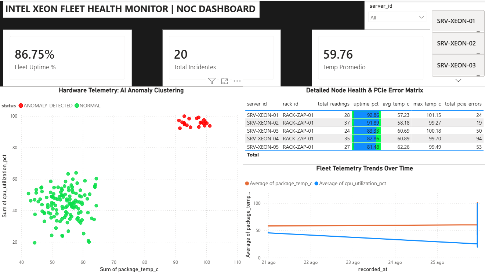
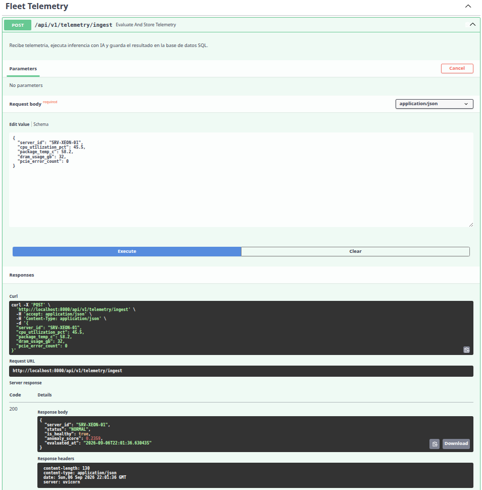

# Server Health Detector: Fleet Telemetry & Unsupervised Anomaly Detection

[](https://www.python.org/)
[](https://fastapi.tiangolo.com/)
[](https://scikit-learn.org/)
[](https://powerbi.microsoft.com/)
[](LICENSE)

An end-to-end data engineering, telemetry ingestion, and machine learning monitoring platform. The system ingests streaming hardware telemetry (CPU utilization, package thermal metrics, and PCIe transaction error counters), detects multivariate operational degradation using an unsupervised Isolation Forest model, persists structured logs into a local datalake/SQLite store, and surfaces operational health via an enterprise-grade Power BI Network Operations Center (NOC) dashboard versioned through `.pbip`.

---

## 📸 System Previews

| Network Operations Center (NOC) Dashboard | Real-Time API Inference (FastAPI Swagger UI) |
| :---: | :---: |
|  |  |

---

## 🏛 System Architecture & Workflow

The architecture handles the lifecycle from low-level hardware simulation to executive visual diagnostics:

```text
[Synthetic Telemetry Agent]
         │ (Package Temp, CPU %, PCIe Errors, Server Metadata)
         ▼
[FastAPI Ingestion Endpoint] ──> [Scikit-Learn Isolation Forest]
         │                                   │ (Anomaly Score / Status)
         ▼                                   ▼
[Relational Database (SQLite)] ──> [Partitioned JSON Datalake Layer]
         │
         ▼
[Analytical SQL Views / CSV Export]
         │
         ▼
[Power BI NOC Dashboard (.pbip)]
```

1. **Hardware Telemetry Simulation (`src/utils/`):** Generates realistic multivariate time-series data reflecting server behavior under standard compute loads as well as severe hardware failure scenarios (thermal throttling, fan failure, bus error saturation).
2. **Unsupervised ML Engine (`src/ai/`):** Utilizes an Isolation Forest algorithm to detect anomalous hardware states without requiring manual static thresholds or pre-labeled operational incidents.
3. **RESTful Service Layer (`src/api/`):** Asynchronous API built with FastAPI providing payload schema validation via Pydantic, low-latency model inference, and persistence handling.
4. **Storage & Datalake (`data/` & `src/database/`):** Implements a two-tier storage layer:
   * **Transactional:** SQLite instance storing validated telemetry, scoring results, and server hardware metadata.
   * **Analytical:** Partitioned JSON datalake (`year=YYYY/month=MM/day=DD`) and processed CSV views (`fleet_master_telemetry.csv`, `fleet_server_kpis.csv`).
5. **Modern Power BI Integration (`dashboard/`):** Fully versioned dashboard using Microsoft Power BI Project (`.pbip`) format, separating semantic modeling (`.SemanticModel`) from visual definitions (`.Report`) for transparent Git source control.

---

## 🛠 Tech Stack

* **Programming Language:** Python 3.10+
* **Machine Learning & Data Science:** Scikit-Learn (Isolation Forest), NumPy, Pandas
* **API Development:** FastAPI, Uvicorn, Pydantic
* **Persistence & Modeling:** SQLite, SQLAlchemy, Partitioned JSON Datalake
* **Business Intelligence:** Microsoft Power BI Desktop (PBIP Git-integrated format)
* **Environment & Tools:** Git, GitHub, Virtualenv

---

## 📁 Repository Structure

```text
server-health-detector/
├── .gitignore
├── README.md
├── requirements.txt
├── telemetry.db                # Relational SQLite database
├── config/                     # Configuration and environment setup
├── docs/
│   └── assets/                 # Project documentation screenshots
├── data/
│   ├── datalake/               # Partitioned raw telemetry (year=YYYY/month=MM/day=DD)
│   └── processed/              # Analytical export datasets
│       ├── fleet_master_telemetry.csv
│       └── fleet_server_kpis.csv
├── dashboard/                  # Power BI Project artifacts (.pbip)
│   ├── fleet_health_dashboard.pbip
│   ├── fleet_health_dashboard.Report/
│   └── fleet_health_dashboard.SemanticModel/
├── src/
│   ├── ai/                     # ML model training and serialization
│   │   ├── intel_health_model.pkl
│   │   └── train_model.py
│   ├── api/                    # REST API endpoints and validation schemas
│   │   ├── main.py
│   │   └── schemas.py
│   ├── database/               # Database connection and SQL views
│   │   ├── analytics_views.py
│   │   ├── connection.py
│   │   └── models.py
│   ├── services/               # Background tasks & data pipelines
│   │   └── cloud_exporter.py
│   └── utils/                  # Telemetry generators & simulators
│       ├── fleet_simulator.py
│       └── telemetry_generator.py
└── tests/                      # Unit and integration test suite